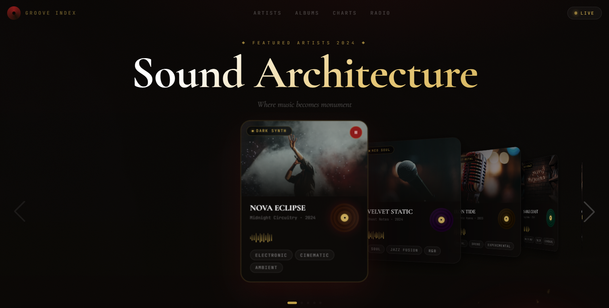
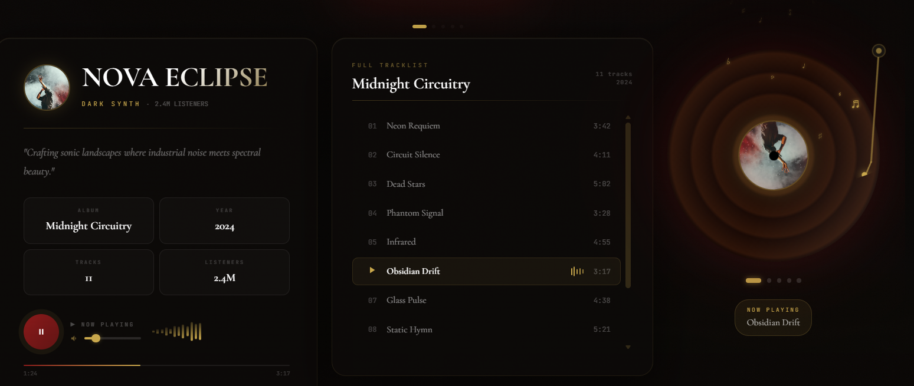

# 🎵 Groove Index

> A dark editorial music artist showcase built with **React + Vite** — featuring 3D Swiper coverflow cards, spinning vinyl records with a tonearm, floating musical notes, and faint generative melodies via the Web Audio API.




---

## ✨ Features

- **Swiper Coverflow** — smooth 3D card stack with depth & rotation, swipe to browse artists
- **Spinning Vinyl** — full-size vinyl disc with realistic grooves, photo center label, and an animated tonearm that sweeps in on play
- **Floating Musical Notes** — `♩ ♪ ♫ ♬ 𝄞 ♭ ♯` drift upward from the vinyl while playing, each with randomised size, rotation and fade
- **Web Audio API** — each artist has a unique melody scale played as soft sine-wave tones with convolution reverb — real faint music, zero audio files
- **Full Tracklist** — scrollable track panel with animated waveform bars on the active track
- **Cinematic Background** — per-artist blurred concert photo that crossfades on slide change
- **Fixed Dark Gold Palette** — deep crimson `#8b1a1a` + antique gold `#c9a84c`, locked regardless of active artist
- **Glassmorphism Panels** — frosted `backdrop-filter: blur` cards throughout
- **Volume Control + Progress Bar** — live track progress and volume slider

---

## 🖥️ Tech Stack

| Tool | Purpose |
|------|---------|
| React 18 | UI & state |
| Vite | Dev server & bundler |
| Swiper.js | Coverflow card carousel |
| Web Audio API | Generative melody + reverb |
| CSS Animations | Vinyl spin, note float, waveform bars |
| Unsplash | Artist & background imagery |

---

## 🚀 Getting Started

```bash
# 1. Clone the repo
git clone https://github.com/your-username/groove-index.git
cd groove-index

# 2. Install dependencies
npm install

# 3. Install Swiper
npm install swiper

# 4. Start dev server
npm run dev
```

Then drop `MusicShowcase.jsx` into your `src/` folder and import it in `App.jsx`:

```jsx
import MusicShowcase from './MusicShowcase'

export default function App() {
  return <MusicShowcase />
}
```

---

## 🎹 How the Audio Works

No audio files are used. On clicking play, the Web Audio API:

1. Creates an `AudioContext` with a master `GainNode`
2. Generates a synthetic reverb impulse via `ConvolverNode`
3. Loops through the artist's **melody array** (semitone offsets from A3 = 220 Hz)
4. Plays each note as a `sine` oscillator with an ADSR envelope
5. Adds a harmony fifth every 3rd step for depth

Each artist has a unique scale — from pentatonic minor (Nova Eclipse) to jazz extensions (Velvet Static).

---

## 📁 Project Structure

```
groove-index/
├── src/
│   ├── MusicShowcase.jsx   # Main component (self-contained)
│   └── App.jsx
├── screenshot/
│   ├── home.png
│   └── music.png
├── index.html
├── package.json
└── vite.config.js
```

---

## 📸 Screenshots

| Home | Now Playing |
|------|-------------|
|  |  |

---

## 📄 License

MIT — free to use, remix, and build on.

---

<p align="center">Built with 🎶 and a lot of dark roast coffee</p>
